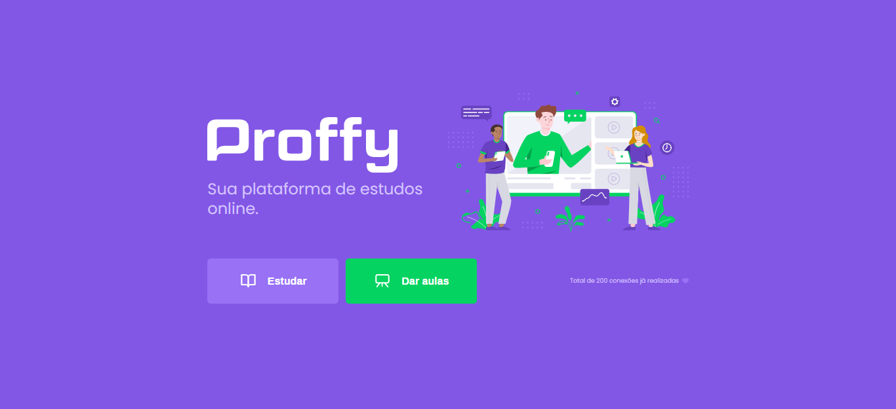

# Proffy backend

Proffy is an online study platform that connects students to teachers, developed during Next Level Week.

  
  

## Technologys

- [Node](https://github.com/nodejs)
- [Typescript](https://github.com/microsoft/TypeScript)
- [Knex](https://github.com/knex/knex)
- [Express](https://github.com/expressjs/express)
- [Sqlite3](https://github.com/sqlite/sqlite)
